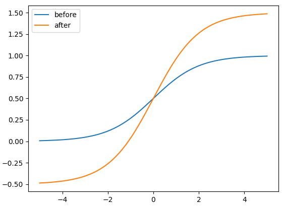
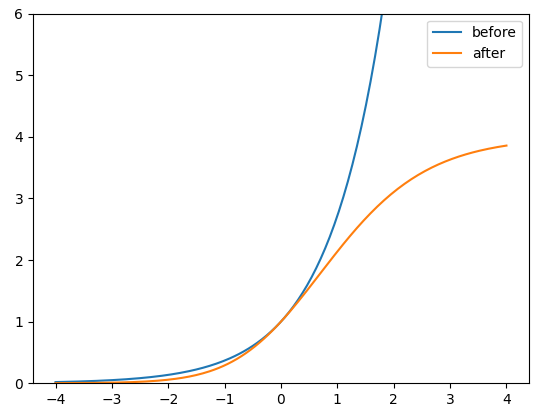
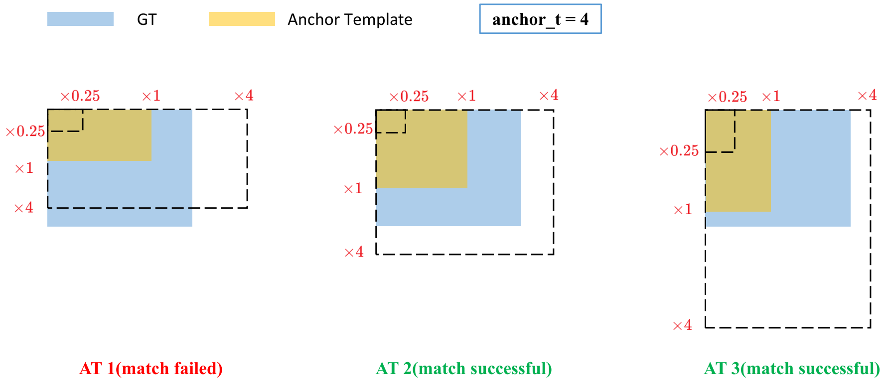
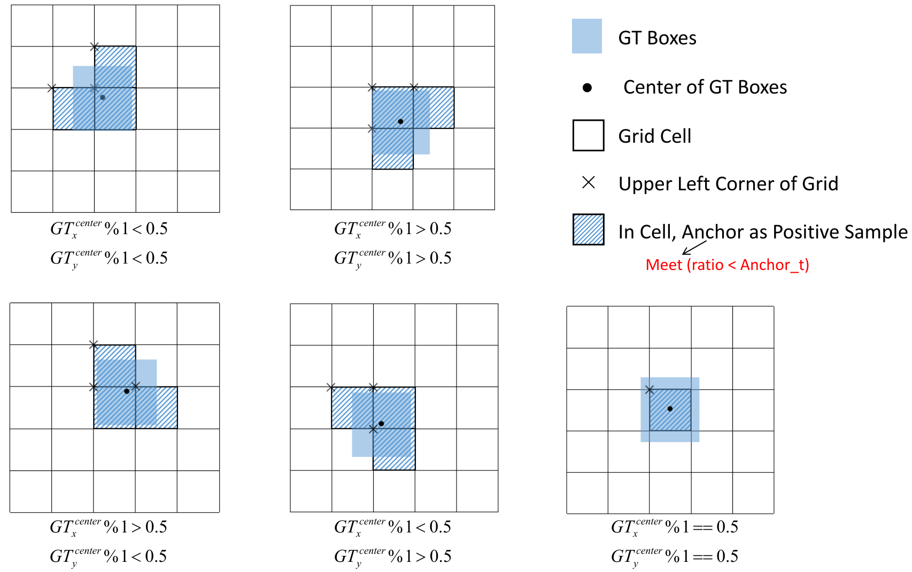

## yolo (Detect)
```python
def _make_grid(self, nx=20, ny=20, i=0, torch_1_10=check_version(torch.__version__, '1.10.0')):
    d = self.anchors[i].device
    t = self.anchors[i].dtype
    shape = 1, self.na, ny, nx, 2  # grid shape
    y, x = torch.arange(ny, device=d, dtype=t), torch.arange(nx, device=d, dtype=t)
    yv, xv = (
        torch.meshgrid(y, x, indexing='ij') if torch_1_10 else torch.meshgrid(y, x)
    )  # torch>=0.7 compatibility
    # add grid offset, i.e. y = 2.0 * x - 0.5
    grid = torch.stack((xv, yv), 2).expand(shape) - 0.5
    anchor_grid = (self.anchors[i] * self.stride[i]).view((1, self.na, 1, 1, 2)).expand(shape)
    return grid, anchor_grid
```
### torch.meshgrid
- ```torch.meshgrid(x, y, indexing='ij')```
- there are two type about the `indexing`
1. `indexing='ij'`
    
    for example, 
    ```python
    H_arange = torch.arange(0, 4)
    W_arange = torch.arange(0, 7)
    grid_i, grid_j = torch.meshgrid(W_arange, H_arange, indexing='ij')
    ```
    the code will return 
    ```python
    grid_i.shape = torch.Size([7, 4])
    grid_j.shape = torch.Size([7, 4])
    grid_i = tensor([[0, 0, 0, 0],
                     [1, 1, 1, 1],
                     [2, 2, 2, 2],
                     ...
                     [6, 6, 6, 6]])
    grid_j = tensor([[0, 1, 2, 3],
                     [0, 1, 2, 3],
                     [0, 1, 2, 3],
                     ...
                     [0, 1, 2, 3]])
    ```
2. `indexing='xy'`   
    for example, 
    ```python
    H_arange = torch.arange(0, 4)
    W_arange = torch.arange(0, 7)
    grid_x, grid_y = torch.meshgrid(W_arange, H_arange, indexing='xy')
    ```
    the code will return 
    ```python
    grid_x.shape = torch.Size([4, 7])
    grid_y.shape = torch.Size([4, 7])
    grid_x = tensor([[0, 1, 2, 3, 4, 5, 6],
                     [0, 1, 2, 3, 4, 5, 6],
                     [0, 1, 2, 3, 4, 5, 6],
                     [0, 1, 2, 3, 4, 5, 6]])
    grid_y = tensor([[0, 0, 0, 0, 0, 0],
                     [1, 1, 1, 1, 1, 1],
                     [2, 2, 2, 2, 2, 2],
                     [3, 3, 3, 3, 3, 3]])
    ```
### `grid = torch.stack((xv, yv), 2).expand(shape) - 0.5`
- the reason for (-0.5)
- in the `loss.py` file, the loss for xy coordinates is `pxy = pxy.sigmoid() * 2 - 0.5`


## loss 
### compute loss: $loss =\lambda_1 L_{c l s}+\lambda_2 L_{o b j}+\lambda_3 L_{l o c}$
- Balance losses

    The objectness losses of the three prediction layers(P3, P4, P5) are weighted differently. The balance weights are [4.0, 1.0, 0.4] respectively.

    $L_{o b j}=4.0 \cdot L_{o b j}^{s m a l l}+1.0 \cdot L_{o b j}^{\text {medium }}+0.4 \cdot L_{o b j}^{\text {large }}$

- Eliminate Grid Sensitivity
    - The original method is :

        $b_x=\sigma\left(t_x\right)+c_x$

        $b_y=\sigma\left(t_y\right)+c_y$

        $b_w=p_w \cdot e^{t_w}$

        $b_h=p_h \cdot e^{t_h}$

        

    - *The current method is*:

        $b_x=(2 \cdot \sigma\left(t_x\right) - 0.5)+c_x$

        $b_y=(2 \cdot \sigma\left(t_y\right) - 0.5)+c_y$

        $b_w=p_w \cdot\left(2 \cdot \sigma\left(t_w\right)\right)^2$

        $b_h=p_h \cdot\left(2 \cdot \sigma\left(t_h\right)\right)^2$

    - the advantages of current method

        Compare the center point offset before and after scaling. The center point offset range is adjusted from (0, 1) to (-0.5, 1.5). Therefore, offset can easily get 0 or 1.

        


        Compare the height and width scaling ratio(relative to anchor) before and after adjustment. The original yolo/darknet box equations have a serious flaw. Width and Height are completely unbounded as they are simply out=exp(in), which is dangerous, as it can lead to runaway gradients, instabilities, NaN losses and ultimately a complete loss of training

        

### build_targets
- calculate the aspect ratio of GT and Anchor templates

    $\begin{aligned} & r_w=w_{g t} / w_{a t} \\ & r_h=h_{g t} / h_{a t} \\ & r_w^{\max }=\max \left(r_w, 1 / r_w\right) \\ & r_h^{\max }=\max \left(r_h, 1 / r_h\right) \\ & r^{\max }=\max \left(r_w^{\max }, r_h^{\max }\right) \\ & r^{\max }<\text { anchor }_{\mathrm{t}}\end{aligned}$

    

- Assign the successfully matched Anchor Templates to the corresponding cells

    

- Because the center point offset range is adjusted from (0, 1) to (-0.5, 1.5). GT Box can be assigned to more anchors.

    